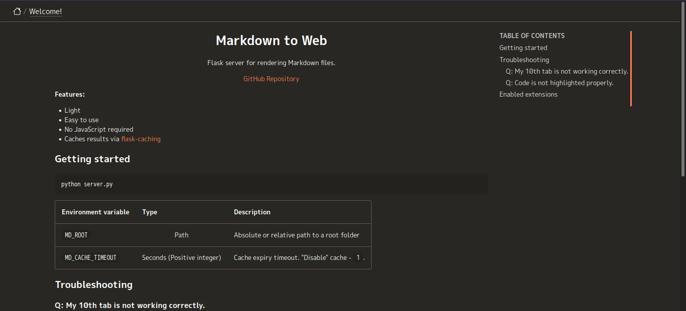
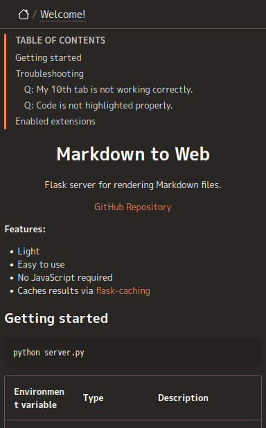

<p align="center">
    <h1 align="center">Markdown to Web</h1>
    <p align="center">
        <a href="https://codeclimate.com/github/arichr/md2web/maintainability"></a>
        <br />
        Flask server for rendering Markdown files.
    </p>
</p>

| Desktop | Mobile |
|---------|--------|
|  |  |

**Features:**

* Light
* Easy to use
* No JavaScript required
* Caches results via [flask-caching](https://github.com/pallets-eco/flask-caching)

## Getting started

```bash
python server.py
```

| Environment variable | Type | Description |
|----------------------|:----:|-------------|
| `MD_ROOT`            | Path | Absolute or relative path to a root folder |
| `MD_CACHE_TIMEOUT`   | Seconds (Positive integer) | Cache expiry timeout. "Disable" cache - `1`. |

## Troubleshooting

### Q: My 10th tab is not working correctly.

This application only supports a maximum of 9 tabs. Consider hacking [app.css](static/app.css) manually.

### Q: Code is not highlighted properly.

Unfortunately, this means that this token type is not yet supported.
Please note that if you want to contribute to the repository with this change, it is more appropriate to use the existing color palette.

## Enabled extensions

* [markdown.extensions.meta](https://python-markdown.github.io/extensions/meta/)
* [markdown.extensions.toc](https://python-markdown.github.io/extensions/toc/)
* [pymdownx.extra](https://facelessuser.github.io/pymdown-extensions/extensions/extra/)
* [pymdownx.inlinehilite](https://facelessuser.github.io/pymdown-extensions/extensions/inlinehilite/)
* [pymdownx.superfences](https://facelessuser.github.io/pymdown-extensions/extensions/superfences/)
* [pymdownx.magiclink](https://facelessuser.github.io/pymdown-extensions/extensions/magiclink/)
* [pymdownx.keys](https://facelessuser.github.io/pymdown-extensions/extensions/keys/)
* [pymdownx.emoji](https://facelessuser.github.io/pymdown-extensions/extensions/emoji/)
* [pymdownx.tasklist](https://facelessuser.github.io/pymdown-extensions/extensions/tasklist/)
* [pymdownx.details](https://facelessuser.github.io/pymdown-extensions/extensions/details/)
* [pymdownx.tabbed](https://facelessuser.github.io/pymdown-extensions/extensions/tabbed/)
* [pymdownx.highlight](https://facelessuser.github.io/pymdown-extensions/extensions/highlight/)
